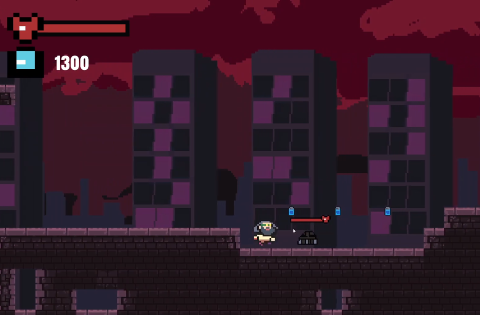

# Nightmare Run

An action based 2d side scroller game project about an old man who lost his life Energy and fell into
a nightmare. The main component of the game should be to combat different kinds of enemies and
obstacles to gain more energy (score) and to get out of the nightmare reality by defeating the final
enemy to get his diary back.

**Link to project:** https://nightmarerun.netlify.app/

## How It's Made:

**Tech used:** C#, Unity, Aseprite, Clion

As I haven’t used Unity before or even C# I spent
a huge chunk of my time restructuring my code. One of the main challenges were to understand
how different objects or their components talk to each other via different scripts. It might be still
insufficient, but I improved my code over time, and it works.

### Player

As I only have one player it made sense to divide all actions into different chunks:

1. PlayerMove : responsible for moving the character on the x axis by the movement speed and flipping
the body accordingly.

1. PlayerHealth: sends data to the health bar and is manipulated if enemy or obstacle damages the
player. If player dies it triggers the game over scene.

1. PlayerFire: instantiates bullet (Ammo) objects to shoot at the enemies
PlayerJump: manipulates the body accordingly. It is triggered if the player is grounded. It has a
simple and a more advanced jump algorithm for a smoother experience.

1. PlayerScore: updates the UI with the current energy score when player collides with the energy
collectable

### Enemy

 It took more adjustments / restructuring than I expected to create multiple enemies. I made a base
enemy Class that all enemies inherit from. Enemies generally patrol in an area, so it was evident that
all enemies inherit that behavior. Only the health, damage and the style of attack differs.
Enemy (Base): It’s in a form of an abstract class so it can not have an instance by itself it has to be
used in a child class. This script has all the necessary variables and object that all enemies will use
such as:

- Movement speed,
- Health
- Patrolling state Boolean
- Ground checker object
- Health bar object,
- Body collider
- Transform of player position

The script also takes care of movement, collision detection (if an obstacle is in front then the enemy
should decide to turn. Damages player on collision

**Patroller enemy**

Uses all the mechanics that the base enemy class, sets up the hp bar for the patroller enemy object
Uses faster movement speed

**Follower enemy**

Uses all the mechanics that the base enemy class and sets up the hp bar. It also have an attack
function. The overwritten base virtual update function is extended that the enemy can decide if the
player is in attack range and able to follow and flip according to the position of the player.

**Gunner enemy**

Different attack function. Based on the player position the gunner is shooting in the player’s
direction. Uses the same ammo structure but with a separate bullet and object and script.

### Ammos
- Ammo of the player
- Ammo of the enemy
- Ammo of the tower obstacle

### Collectables
- Health collectable heals the player if it’s health not full already.
- Energy collectable rewards player with score.

### Obstacles
- Water damages player on collision, but player can jump out of it.
- Spike pit damages player on collision and throws up player up and right to indicate the damage
- Gunner tower: A constant stream of lasers for the player to dodge

### Parallax
Implementing parallax background scrolling had some weird dithering of the object while moving.
Adjusting the values of the z axis to determine the far or near Clipping Plane made it smoother as I
experimented.

### Structure & Inheritance
The most difficult task was to understand how objects and their components interact or how scripts
communicate with each other. As a starting point I made longer more dense scripts that include
most of the functionalities of either the player or the enemy. As an example I had the Move();
function and it had the Jump(); inside it. Later when I wanted to use more complex logic it made
sense to rethink the structure. The player then was divided based on actions. Firing, scoring, moving,
health had their own functionality. As only one player object was used it didn’t make sense to have a
constructor or to have a base class that others inherit from.
When it comes to the enemy object, I had the same mentality at the beginning. A long script that
had everything from moving – shooting. I restructured the
enemy object and it made sense to have a base class that have all the essential variables and
functions. I knew that I won’t have too complex stuff as jumping so patrolling, moving could
fit in a script without being too long. As the base class had virtual functions and cannot be
used as a stand-alone game object, I just had to make 3 different enemy scripts that have
their own flavour. This way it was way easier to keep track of each enemy’s development
progress. At the end I learned more about inheritance, virtual functions, the way to override
them and most importantly to have the instance of the object working properly.

## Optimizations

After this project I am certain that I want to get myself into a new game development project as a
hobby. I have a more well-rounded idea how I could add on top of this game or how I could reuse
the bits I developed. Here I am listing all the mechanics and aspects that I would love to tackle:

- A dialog / inventory system to collect miscellaneous items along the way to enhance story telling
- Save system
- More obstacles and enemies
- Different levels
- Boss fights
- More detailed environment assets and animations
- Sound

## Lessons Learned:

1. Striking the right balance between scripting and focusing on the art. The project timeline was roughly nine months. Much effort went into the careful consideration of scoping the project. In order to have the minimal viable product as soon as possible, I had to sacrafice the art aspect initially then put more emphasis on it later.

 1. By following OOP principles, it was more convinient to create different objects and maintain the codebase.

